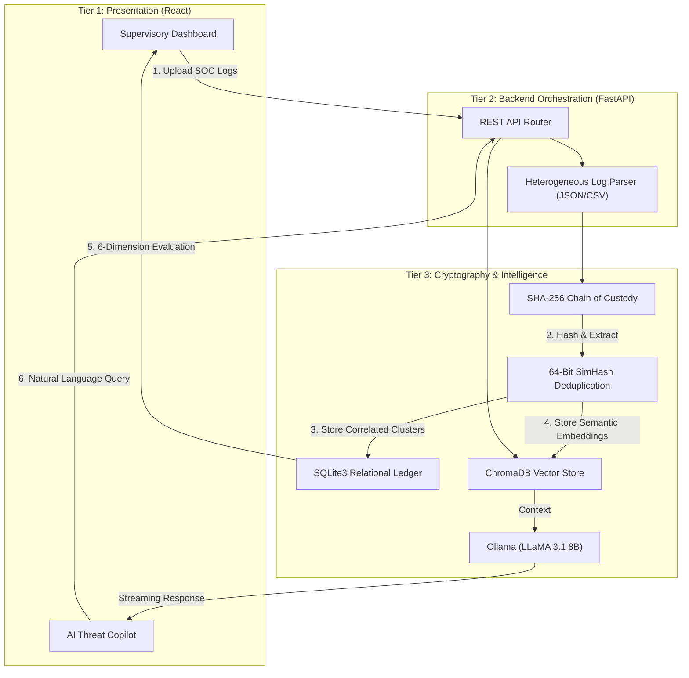

# System Architecture: SAT-SA (SIH26157)
**Supervisory Analytics Tool for SOC Assessment** | *Team RAGForge*

---

## 1. Architectural Overview
SAT-SA is engineered as a **100% air-gapped, zero-cloud supervisory intelligence platform** tailored for the National Critical Information Infrastructure Protection Centre (NCIIPC). It decouples the presentation layer from a heavy cryptographic and AI processing engine, ensuring that massive volumes of enterprise SOC telemetry can be evaluated locally on commercial off-the-shelf (COTS) hardware without breaching data sovereignty protocols.

The architecture is divided into three primary tiers:
1. **Frontend (Presentation & Supervisory UI)**
2. **Backend (API & Orchestration)**
3. **Intelligence Engine (Cryptography, Deduplication, & Local AI)**

---

## 2. Component Tiers & Technology Stack

### Tier 1: Frontend (Supervisory Command Center)
Built for high-density data visualization and rapid triage.
* **Stack:** React 18, TypeScript, Tailwind CSS, Vite.
* **Functionality:** 
  * Renders the **Assessment Dossier**, scoring entities across 6 statutory dimensions.
  * Provides a **Dual-Pane Forensic View**, allowing auditors to view aggregated alerts alongside the unmasked, raw JSON payload.
  * Manages client-side state without enforcing cloud-based IAM, adhering strictly to the air-gapped constraints of the problem statement.

### Tier 2: Backend (Orchestration & API)
The central nervous system mediating between the UI and the heavy data engines.
* **Stack:** Python 3.9+, FastAPI, Uvicorn, Pydantic.
* **Functionality:** 
  * Exposes asynchronous REST endpoints (`/api/v1/ingest`, `/api/v1/assessments`, `/api/v1/copilot`).
  * Orchestrates the ingestion pipeline, passing raw files to the deduplication engine before persisting them to the database.

### Tier 3: Intelligence & Cryptography Engine
The core differentiator of SAT-SA, replacing manual auditing with mathematical verification.
* **SimHash Clustering:** Applies a 64-bit structural hash to log payloads. Collapses tens of thousands of repetitive, noisy firewall pings into single "Incident Clusters," achieving a **95%+ reduction in alert fatigue** in $\mathcal{O}(N)$ linear time.
* **SHA-256 Ledger:** Generates an immutable cryptographic digest for every ingested log batch, ensuring absolute chain-of-custody and legal defensibility.
* **Vector Store & Full-Text Search:** Utilizes **ChromaDB** for semantic embedding storage and **SQLite3 (FTS5)** for exact-match keyword indexing.
* **Local LLM Copilot:** Leverages **Ollama (LLaMA 3.1 8B)** to provide a Retrieval-Augmented Generation (RAG) chat interface. It acts as an autonomous forensic agent, parsing complex log structures and explaining threat vectors in natural language without making external network calls.

---

## 3. Data Flow & Execution Pipeline

---

## 4. Operational Viability & Constraints
* **Deployment Constraints:** Requires no external SaaS subscriptions, cloud-hosting fees, or proprietary API keys. Operates fully isolated on standard local workstations (minimum 8-16 GB RAM).
* **Scalability:** The linear nature of SimHash allows the system to process millions of log rows efficiently without requiring GPU acceleration for the deduplication phase.
* **Regulatory Compliance:** Directly fulfills continuous monitoring mandates required under Section 70A of the Information Technology Act (2000), automating manual compliance checks and exposing execution gaps within enterprise SOC environments.
